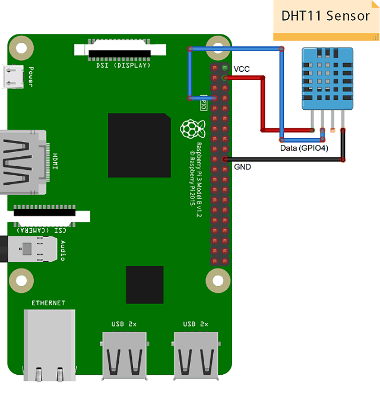

## ⏯️ IoT PART OF THE BELOW REPO


 ## :octocat: Project GitHub Links:
- <a href="https://github.com/appuabhishek/counterfeit-medicine">Counterfeit Medicine Authentication System </a>


## ⏯️ Explanation + Demo Video(click image)

<a href=""> </a>

<!-- GETTING STARTED -->
## 👀 Getting Started

### Circuit Diagram



### CONNECTING RASPBERRYPI TO SYSTEM
- <a href="https://youtu.be/F5OYpPUJiOwe">WITH LAN CABLE </a>
- <a href="https://youtu.be/I-vCFP2jD1g">WITHOUT LAN CABLE </a>

## ⛏️  To execute the code

1.Create an thingspeak account or any cloud service account and generate an API key

2.open terminal , change directory  to the  ```apiTemp.py``` file directory.

3.open the file and alter the API key to your API key 

3.excute ```sudo python apiTemp.py``` and code will send api data to thingspeak server(any server of your choice) at regular intervals you can modifiy the duration to change the intervals


